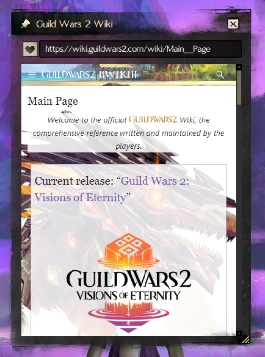

#  WebPeeper - Blish-HUD Module

 
 
A Web Browser dependent on the GW2 CEF library.  

 

#### **⚠️ The Core is Based on Chromium 103.0.5060.114, which was Released in 2022.**
#### **⚠️ DO NOT Browse Untrusted or Security-Sensitive Websites with an Outdated Chromium Version.**

## Download
From [Releases](https://github.com/cy-sp-howard/WebPeeper/releases) page.  

## Remarks
- Uses Mobile User-Agent by default. Can be switched to PC in the settings.
- Allow simulating touch event to replace the default mouse event.
- The GW2 CEF library uses Chromium version 103.0.5060.114.
- Sub-Processes will keep running in the background until Blish-HUD closes. Closes certain processes via `Quit Process` command.
- The Module extracts necessary files to `%ProgramData%\Blish HUD\cache\cefsharp\`.
- Chromium user-data is created at `%USERPROFILE%\Documents\Guild Wars 2\addons\blishhud\webpeeper\`.

## Install Guide
1. Right-click Blish-HUD icon from system tray where bottom right.
2. Left-click "Open settings folder".
3. Paste [WebPeeper.bhm](https://github.com/cy-sp-howard/WebPeeper/releases) file into "modules" folder.
4. Restart Blish-HUD.
5. Click the Blish-HUD icon in the game then Left-click the `WebPeeper` tab under `Manage Modules` section.
6. Click the `Enable` button to enable `WebPeeper` module.

More detail from Blish-HUD Offical [Tutorial](https://blishhud.com/docs/user/installing-modules#manually-installing-modules).

## Download Blish HUD
From [Releases](https://github.com/blish-hud/Blish-HUD/releases) page here on the [Blish Repo](https://github.com/blish-hud/Blish-HUD).

## Compile Requirements
- Visual Studio 2022
- .NET Framework 4.7.2

